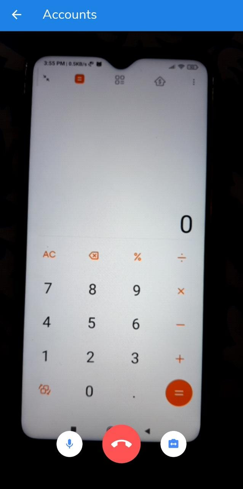
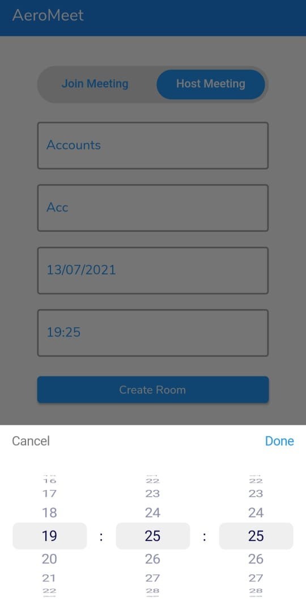

# AeroMeet

<!-- Add banner here -->

# AeroMeet by Gurleen

Float on air, with AeroMeet! This project was built as a part of the Microsoft Engage Mentorship Program 2021 where mentees were promoted to follow agile methodolgy to develop a video conferencing application.
<b>Motivation:</b> The need for social distancing has made each one of us feel disconnected from our family, friends, colleagues. This lack of connectedness isn’t only a detriment to employee satisfaction and wellbeing. When you consider that collaboration truly hinges on the interpersonal magic of teammates working together, it’s easy to see how the retreat to WFH could run the risk of eroding team productivity and innovation. Overhere, video conferencing platforms such as Microsoft Teams come into the picture, to feel us more connected.

<b>Solved Problem:</b> This mobile application is an online video meeting platform which powers all of your communication needs, including video meetings, one-on-one chat, audio calling, webinars, and online events.

# Table of contents

- [Features of the Application (With Demo)](#features-of-the-application-with-demo)
- [Tech Stack Selection](#tech-stack-selection)
- [Usage of Scrum Methodology (With Demo)](#usage-of-scrum-methodology-with-demo)
- [Challenges Faced](#challenges-faced)
- [Learnings](#learnings)
- [Future Scope](#future-scope)
- [Bug Log](#bug-log)
- [Try The Mobile Application](#try-the-mobile-application)

# Features of the Application (With Demo)

1. Signup
2. Login
3. Logout
4. Schedule meetings
5. One on one video calling 
6. Group video calling
7. Toggle microphone
8. Switch camera
9. Disconnect call
10. One on one chatting (only for logged in user)
11. Audio calling (only for logged in user)
12. Share images while chatting
13. Customizable profile card

 

[Watch the Intro on YouTube](#https://youtu.be/tXK0Fz1cj4E)

 

[Watch the Demo on YouTube](#https://youtu.be/tXK0Fz1cj4E)

# How To Use

1. Go to the profile section and enter your credentials after clicking on 'Register' option.

 

 

2. Come back to the Sign In page and enter user details again to sign in.

 

 

3. Either you can go to the dashboard for meetings or chat to have one to one chat.

 

 

4. For joining the meeting user has to enter the room id, shared with him and enter display name, after clicking on join now, user can enter into the meeting room.

 
 

 

5. To host a meeting, enter the meeting title, room id, set date and time. Press on create room and voila! room is created.

 
 
 

 

6. In the history section, past entered meetings are available which can either be entered again by copying the room id or deleted.

 

 

7. If signed in, user can enjoy one to one chat functionality by entering the other users unique personal identity id, available under the profile section, after clicking on the search icon.

 
 

 

8. Audio calling, video calling, sending messages and sharing images are the features which the signed in user can leverage under the message option.

 
 

 

9. Highly customiizable profile card under the profile section gives user freedom to change his/her display name and display image.

 
 
 
 

 

NOTE: User can join or create meetings without even logging in but cannot use chatting feature.

[(Back to top)](#table-of-contents)

# Tech Stack Selection 

Mobile apps have become one of the important parts of our life that connects us with people living in different places just by sitting at home hence, I decided to develop a <b>mobile application</b> so that it allows users to access the application on the go.

For frontend development, I have used <b>Flutter</b>, which helps to create cross-platform applications. For backend development, I have used <b>Firebase</b>. After deep analysis, <b>Agora SDK</b> was choosen as the most suitable real time engagement platform.

[(Back to top)](#table-of-contents)

# Usage of Scrum Methodology 

Scrum is an agile development methodology used in the development of software, based on an iterative and incremental processes. The primary objective of Scrum is to satisfy the customer’s need(which in this case was a video conferencing platform) through an environment of transparency in communication, collective responsibility and continuous progress. The development starts from a general idea of what needs to be built, elaborating a list of characteristics ordered by priority (product backlog) that the owner of the product wants to obtain.

Dividing myself into five different people - one who will research and look over everything, one who will design, one who will develop the frontend, who who will develop the backend and finally one who will fix the bugs - made the task a lot easier. This breakdown helped me to be domain-oriented and focus on one task at a particular point of time.

This iterative approach assisted me to divide this large project into easily maageable sprints, increasing rate of deliverables, and adapting to changes as they occur.

I used Notion as the primary application for designing the mindmap and keeping the record of tasks, and bugs under each sprint.

* <b>Using Notion for managing sprints</b>

 
I divided entire process into <b>4 sprints (each having the duration of 1 week)</b> as shown in the images below.
 
 

 

Assignments and sessions under the program were separately maintained.

[(Back to top)](#learnings)

1. Break the work down into the smallest chunks and smaller wins in the scrum methodology make bigger wins easier, is the most significant takeaway from this mentorship journey.
2. Got insights about the real-time video conferencing softwares such as WebRTC, Twilio, and SDKs like Agora, Jitsi_Meet SDK.
3. Model View Controller(MVC) Architecture, helped to differentiate these(Model, View, Controller) three basic components of a project to write neat and modular code. Following this approach helped me to work on each feature separately without affecting the other one.
4. Practiced Firebase Could Firestore queries in terms of multilevel collections and documents integrated with each other.

This program was all about challenging one's comfort zone and it only helped me to trasform from a person who just knew how to make static UI to a person who can build full stack mobile applications.

[(Back to top)](#table-of-contents)

# Challenges Faced

During the development process I faced the following challenges: 

1. Choosing the video conferencing API. Having a lot of resources available in the market, it was really difficult to make a choice. After a lot of research, compatibility and user experience as prime factors during consideration, I finally decided to go ahead with Agora SDK.
2. Memory Management. Passing appropriate data between different pages and avoiding any memory leaks seemed like an issue at during scheduling of meetings due to continuous debugging I was able to resolve that issue.
3. Backend. For the very first time I was working with backend side hence, I was worried about the database integration and management. However, with the help of online communitites such as Stackoverflow I was able to manage this situation.
4. AeroMeet's feature list. During the design phase I wanted to build a perfect application by embedding all the features available to me but in order to buy some time I had narrow down the number of features.
5. Adapt feature. Initially, it seemed impossible to me to incorporate this feature. However, with the constant support by my parents and friends I was able to implement this feature although not covering all the aspects listed.

For me, all these challenges turned out only into one important lesson that is to prioritize customer needs above anything else.

[(Back to top)](#table-of-contents)

# Bug Log

Following are the known bugs of the web application: 
1. There could have been an onboarding screen for great user experience.
2. An individual might not be able to signup and register themselves smoothly.

[(Back to top)](#table-of-contents)

# Try The Mobile Application

APK of application: https://drive.google.com/file/d/1eH2yXe8TKsdHzgdLPDtlPq3-11d4F4zZ/view?usp=sharing
Credentials for testing:
Email- gauravdhod56@gmail.com
Pwd - Gaurab1234+

[(Back to top)](#table-of-contents)

# Support and Contact 

Email To: gurleendhod.sid@gmail.com

[(Back to top)](#table-of-contents)
